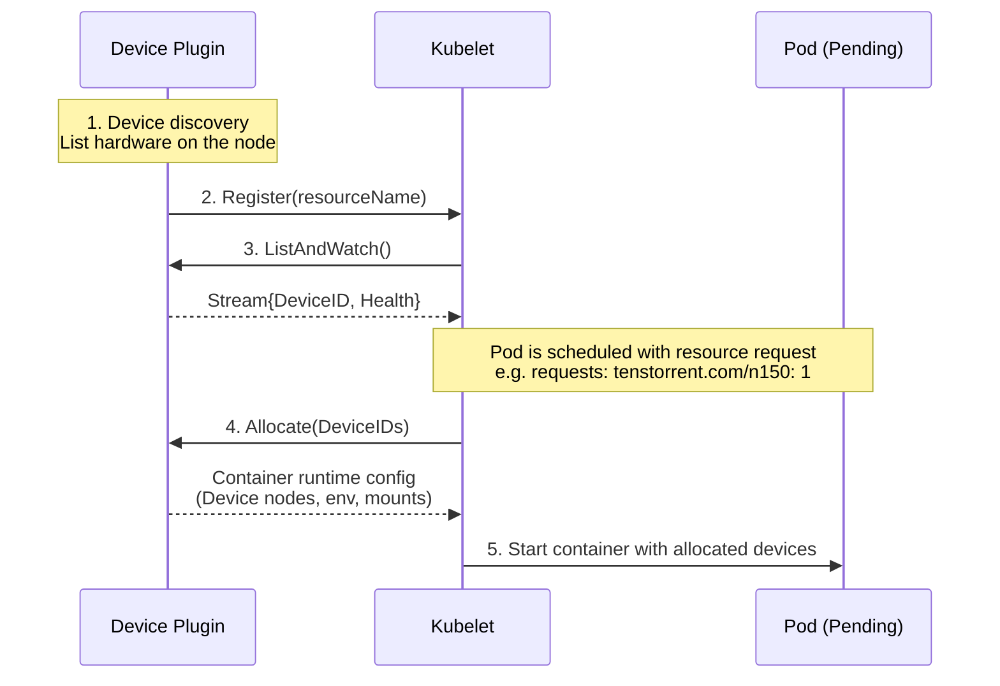

# Tenstorrent device plugin for Kubernetes

## Summary

This plugin adds support for Tenstorrent devices to Kubernetes and reports device into to the kubelet. See [Device Plugins](https://kubernetes.io/docs/concepts/extend-kubernetes/compute-storage-net/device-plugins/) for upstream documentation.

WARNING: This is in active development and is not complete. In the meantime, I suggest using [generic-device-plugin](https://github.com/squat/generic-device-plugin)

## Prerequisites

To use this device plugin, you must first have already installed `tt-kmd` on the kubernetes hosts.
See [github.com/tenstorrent/tt-kmd](http://github.com/tenstorrent/tt-kmd).

## Getting Started

You can deploy the tenstorrent `k8s-device-plugin` in kind by running:

```sh
kind create cluster -f kind.yaml

kubectl apply -f device-plugin-daemonset.yaml
```

You should then see a tenstorrent device in the `status.allocatable` portion of the nodeSpec:

```sh
kubectl get no kind-control-plane -o json | jq '.status.allocatable'
{
  "cpu": "10",
  "ephemeral-storage": "100476656Ki",
  "hugepages-2Mi": "0",
  "memory": "16359768Ki",
  "pods": "110",
  "tenstorrent.com/n150": "4"
}
```

With the plugin deployed, and devices showing up as allocatable, you can then schedule an example workload:

```sh
kubectl apply -f example-workload.yaml
```

## How it works

A device plugin is a small gRPC service on each node that discovers hardware, registers custom resources with tge kubelet, and when a Pod requests those resources, provides the runtime instructions needed to attach the device to the container.

You would typically find this information from `tt-smi -ls` or in the `/dev/tenstorrent` device tree.

Conceptually, you could then tell the kubelet about that and make a request for a card to get it scheduled. That process would look like this:



## Roadmap

- [ ] Enumerate the hardware
  - [x] a fake list at first
  - [ ] actual hardware
- [x] Implement the gRPC server for the Kubernetes Device Plugin API
  - [x] [Register](https://kubernetes.io/docs/concepts/extend-kubernetes/compute-storage-net/device-plugins/#device-plugin-registration)
  - [x] Register with kubelet via the Unix socket
- [ ] Return something valid from `Allocate()` ()
- [ ] Test E2E ([see Example](https://kubernetes.io/docs/concepts/extend-kubernetes/compute-storage-net/device-plugins/#example-pod))
- [ ] Enable better health check management. There is no direct pod/workload calls backs to know when the card is not mounted anymore. Usage would need to be inferred by the device-plugin from other sources.
- [ ] **Refactor `internal/plugin` by concern:** Split `device_plugin.go` into `device_plugin.go` (struct + gRPC interface methods), `health.go` (checkDeviceHealth, RunStartupHealthChecks), and `server.go` (Start, Register, dial). Keeps the package small and isolates health and lifecycle logic; aligns with the pattern used in `internal/prerequisites/`.

## Testing

No real hardware is required. All tests use mocks and temporary Unix sockets.
Tests assert only against the public API (exported types and gRPC responses), never against unexported internals.

### Unit tests

Unit tests live in `*_test.go` files alongside the source they cover (e.g. `internal/plugin/device_plugin_test.go`). They test business logic in isolation: device discovery, allocation, health checks, registration, and error handling.

```sh
go test ./internal/...
```

### Integration tests

Integration tests live in the `integration/` directory and exercise the plugin as a whole over gRPC (server, ListAndWatch, Allocate, Register). They use `testify/suite` for structured setup/teardown and include concurrency tests.

```sh
go test ./integration/...
```

To skip integration tests in quick CI runs:

```sh
go test -short ./...
```

### All tests (with race detector)

```sh
go test -race ./...
```

Running the tests within a docker container:

```sh
docker run --rm -v "$(pwd)":/src -w /src golang:1.25-bookworm go test -race ./...
```

### Testing in (Kind) Kubernetes
```
# 1) Build image
docker build -t k8s-device-plugin:test .

# 2) Create Kind cluster (uses kind.yaml)
kind create cluster -f kind.yaml

# 3) Load your image into Kind (so the DaemonSet can use it)
kind load docker-image k8s-device-plugin:test

# 4) Deploy the plugin (edit device-plugin-daemonset.yaml to use k8s-device-plugin:test)
kubectl apply -f device-plugin-daemonset.yaml

# 5) Check plugin and node allocatable
kubectl get pods -n kube-system -l app=k8s-device-plugin
kubectl get no kind-control-plane -o json | jq '.status.allocatable'

# 6) Run example workload (pod requesting tenstorrent device)
kubectl apply -f example-workload.yaml
kubectl get pods
kubectl describe pod <example-pod-name>
```


## Reference

|Link|Description|
|-|-|
|[Device Plugin Docs](https://kubernetes.io/docs/concepts/extend-kubernetes/compute-storage-net/device-plugins)|A high level guide on how device plugins work|
|[tt-kmd](https://github.com/tenstorrent/tt-kmd)|Tenstorrent Kernel mode driver. A reference for how the device node(s) and sysfs is populated.|
|[tt-kmd sysfs attributes docs](https://github.com/tenstorrent/tt-kmd/blob/bda2c96c3a3eb5ee48db2f5a054a5fff83629d49/docs/sysfs-attributes.md)|Documentation specficially regarding the driver's sysfs device attributes|
|[Device Manager Proposal](https://github.com/kubernetes/design-proposals-archive/blob/main/resource-management/device-plugin.md)|Learn more about the design of the device manager and how it came to be|
|[Kubelet Device Manager code](https://github.com/kubernetes/kubernetes/blob/release-1.33/pkg/kubelet/cm/devicemanager/plugin/v1beta1/client.go)|This is the consumer of our DevicePlugin|
